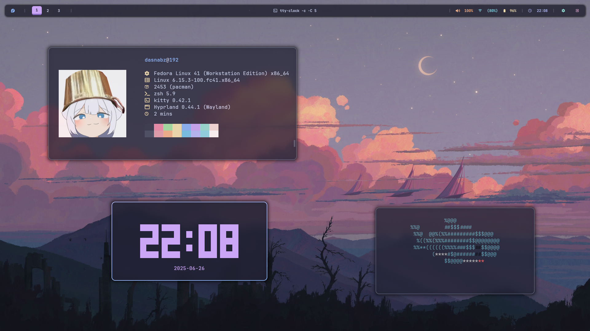

# Boreadots Dotfiles

<p align="center">
  
</p>

## Overview

Welcome to **boreadots**! This repository contains my personal (messy) dotfiles and configurations for a modern Linux desktop, themed with Catppuccin Mocha. Use these as a base for your own setup or to quickly replicate my environment.

## What's Included?

All configuration files and package lists are in the `.config/` directory. Preconfigured apps and tools include:

- **Hyprland** (hypr)
- **Kitty** (kitty)
- **Neovim** (nvim)
- **Waybar** (waybar)
- **Rofi** (rofi-wayland)
- **Sway** (sway, swaylock)
- **Qt5ct & GTK** (qt5ct, gtk-3.0, gtk-4.0)
- **HTOP** (htop)
- **Nwg-look** (nwg-look)
- **Shell configs** (zshrc, bashrc)

## Installation

### 1. Clone the Repository

You can clone this repository anywhere (commonly `~/.dotfiles`):

```sh
git clone https://github.com/LightNabz/boredots.git ~/.dotfiles
cd ~/.dotfiles
```

### 2. Installation Script

> **Note:**  
> The installation script is **not finished yet**. Fedora and Arch Linux use different package repositories, so the script is still being developed for cross-distro support.

For now, you can manually copy the configs from `.config/` to your home directory and install the required packages listed below.

## Required Packages

Install these packages using your distro’s package manager:

- hyprland
- kitty
- neovim
- waybar
- sway
- swaylock
- qt5ct
- htop
- nwg-look
- rofi-wayland (AUR for Arch, COPR or build for Fedora)
- zsh, bash

**Arch Linux example:**
```sh
sudo pacman -S hyprland kitty neovim waybar sway swaylock qt5ct htop nwg-look zsh bash
yay -S rofi-wayland
```

**Fedora example:**
```sh
sudo dnf install hyprland kitty neovim waybar sway swaylock qt5ct htop nwg-look zsh bash
# For rofi-wayland, see https://github.com/lbonn/rofi for Fedora instructions
```

## Backups

Before replacing any configs, make sure to back up your existing dotfiles. You can do this manually:

```sh
cp -r ~/.config ~/.config_backup_$(date +%Y%m%d)
```

## Uninstall / Restore

To revert, restore your backup:

```sh
cp -r ~/.config_backup_YYYYMMDD/* ~/.config/
```

## Contributing

Feel free to contribute~

---
**Note:**
- Waybar theme like on the Screenshot above is "transparent-2"
- The install script will be updated later (mending fesnuk daripada ngurus ini)


